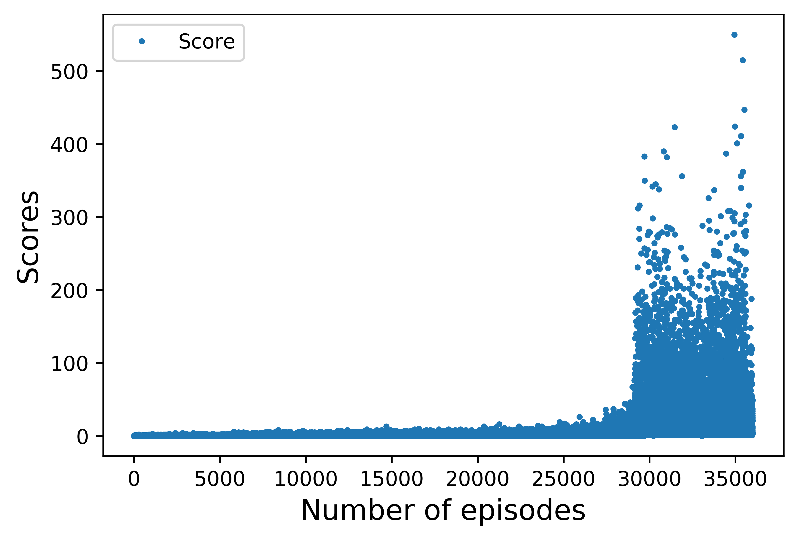

# Deep Q-Network and Q-leanring for Flappy Bird

## Overview
The objective of this project is to implement and compare different reinforcement learning algorithms, including Deep Q-Network (DQN) and Q learning, to train a flappy bird such that the final outcome can reach or even outperform human experts.


Before training: 
After training: 

## Prerequisites:
* Python 3.6 or lower (pygame is not compatible with Python 3.7)
* TensorFlow 2.1.0
* pygame
* OpenCV-Python
* numpy
* Install the interactive game following the instruction here: https://github.com/sourabhv/FlapPyBird

## Installation
```
git clone https://github.com/zoexu119/RL689-Flappy-Bird.git
cd RL689-Flappy-Bird
pip install -r requirment.txt
```

## Running
- The best Flappy bird using standard Q-learning is in Experiment 6. Need one minute to get well-trained.

- The Flappy bird using backward updated Q-learning is in Experiment 7. Need less than a minute to get well-trained.

- The best Flappy bird using Deep Q-Network is in Experiment 8. Need about one and half day to get well-trained.

- Experiments 1, 2, 3, 8 have game display. Experiments 4-7 have no game display.

- If you want to use our pre-trained models, please download it from "Data generated by this project",
and replace it with the empty "saved_models" folder. Else, Experiments 1, 2, 8 will start training
from the initialized model.

- Currently, raw statistics are printed out during the training for easier monitor. If you want to log raw statistics
into a log text file, please uncomment the file name at the top part of each experiment_<No.>.py
as below.
```
logging.basicConfig(
    # filename="log_exp1.txt",
    format='%(asctime)s %(levelname)-8s %(message)s', level=logging.INFO,
    datefmt='%Y-%m-%d %H:%M:%S')
```

#### Experiment 1
DQN algorithm with epsilon-greedy policy. State space is the stack of four latest pre-processed snapshot images of the game. The design is originally from the [awesome work of yenchenlin](https://github.com/yenchenlin/DeepLearningFlappyBird/), but we updated it for TensorFlow 2.1.0. And you can start from any checkpoint by changing the checkpoint name. See detailed instructions in readme.txt under empty "saved_models" model.                                                                                        
```
python experiment_1.py
```
#### Experiment 2
Double DQN algorithm with epsilon-greedy policy. The target model will be updated to be same as the Q model for every C steps. You can change the parameter C in line 33 (default C=5000). 
```
python experiment_2.py
```
#### Experiment 3
Q-learning with epsilon-greedy policy. State space is comprised of the vertical and horizontal distance between the bird and the coming lower pipe. Information of distance is extracted by processing the snapshot of screen image.
```
python experiment_3.py
```
#### Experiment 4
Q-learning with epsilon-greedy policy. State space is comprised of the vertical and horizontal distance between the bird and the coming lower pipe. Information of distance is extracted from the gaming code directly, thus not displaying the game screen.
```
python experiment_4.py
```
#### Experiment 5
Q-learning with epsilon-greedy policy. State space is comprised of the vertical distance, horizontal distance, and vertical velocity of bird. No game display.
```
python experiment_5.py
```
#### Experiment 6
Q-learning with greedy policy. State space is comprised of the vertical distance, horizontal distance, and vertical velocity of bird. No game display. Compare with Experiment 5.
```
python experiment_6.py
```
#### Experiment 7
Q-learning with greedy policy. State space is comprised of the vertical distance, horizontal distance, and vertical velocity of bird. No game display. Q values are updated backwards from the last step to the first step at the end of each episode. Additional punishment is added to high death jump case. The design is originally from the [awesome work of chncyhn](https://github.com/chncyhn/flappybird-qlearning-bot/), but we rewrote the code to fit our own code structure.                                                                                                                                                                                                                                                                                                                                                                 
```
python experiment_7.py
```
#### Experiment 8
DQN algorithm with greedy policy. State space is the stack of four latest pre-processed snapshot images of the game. Compare with Experiment 1.
```
python experiment_8.py
```
#### Post-process:
To process raw data generated by experiments, and generate plots,
please use following notebooks as reference.
```
process_raw_data.ipynb
plot.ipynb
```
## Data generated by this project
- all trained DQN and double DQN checkpoint networks are available [here](https://drive.google.com/open?id=1U80yaT4Ed1PC60Wp6OdvboNtYZaoCnhB)
- raw logged data for all experiments is available [here](https://drive.google.com/open?id=18eO4gZ4M0XL_sci4rFBYfOHR1uN4Kyxr)
- post-processed result of each experiment is shown as below

#### Experiment 1:


#### Experiment 2:


#### Experiment 3 & 4:

Results are not good. No plot.


#### Experiment 5:




#### Experiment 6:


#### Experiment 7:


#### Experiment 8:


## References
1. [sourabhv/FlapPyBird] (https://github.com/sourabhv/FlapPyBird)
2. [yenchenlin/DeepLearningFlappyBird] (https://github.com/yenchenlin/DeepLearningFlappyBird)
3. [chncyhn/flappybird-qlearning-bot] (https://github.com/chncyhn/flappybird-qlearning-bot)
4. http://sarvagyavaish.github.io/FlappyBirdRL/
5. Mnih, et al. “Playing atari with deep reinforcement learning.” arXiv preprint arXiv:1312.5602 (2013).
6. Mnih, et al. “Human-level control through deep reinforcement learning.” Nature 518.7540 (2015): 529-533.


